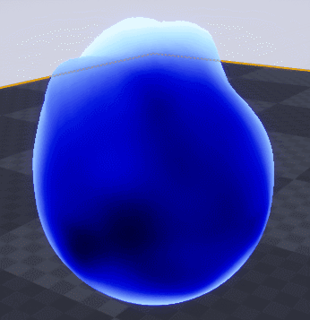

I created this blog for two main reasons. The first one is to track the development of the game and keep a step by step screenshot of the game.
And the second one is that I hope it will help me to keep motivation during the whole development. If this blog can help anyone, or be interresting in any way, I will take it. Sharing and talk with other developer might be cool too!

Because it's a project I'm doing on my free time, i will do my best to keep it updated. I'm will try my best to publish one post every week.

&nbsp;

## So what's the project?

The first step is to make a **_prototype_** from scratch in approximatively **6 months**. (end in _December 2018_)
Once the [_greybox_](http://jackw-gamedesign.tumblr.com/post/139960850160/what-is-greyboxing) is done, the road-map for the _production_ game will be decided. Probably starting with a [_vertical slice_](https://en.wikipedia.org/wiki/Vertical_slice).
  
 &nbsp;
 &nbsp;
 

### Game Structure

_Some Key Features:_
* Boss Rush.
* Mix between Rhythm and Action Game.
* Synchronization between gameplay and BGM.
* Two different gameplay.
* Smooth animation and flow.
* Strong narrative in speechless world.
* Good Replayability.
* No HUD.
* Gameplay First.

&nbsp;

### Prototype

So what will be in the **_prototype_**:
* 1 Boss (2 variations)
* 2 Core Gameplay
* All main features: Level Streaming, UI Menu, Save/Load...

For the prototyping I will try to use Unreal engine, without any prior knowledge. Before this post, I made few test, to decide which engine will be used for this game nothing more.

&nbsp;

     
    

        
         
        Flame
    

&nbsp;

     
    

        
         
        Blending Shader
    

&nbsp;

That's all for this first post. I will talk about the game, feature by feature, later. I'm trying to keep some mystery!

PS: My english is bad.