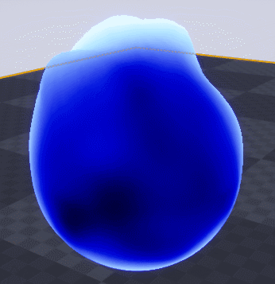
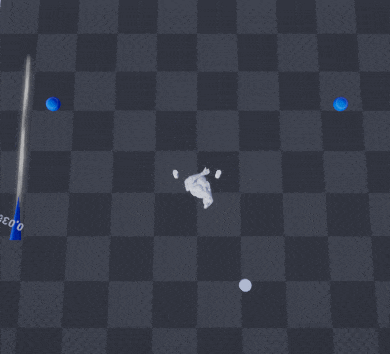

That's the begining, the motivation overflow. 
&nbsp;
&nbsp;

## So what's the project?

The first step is to make a **_prototype_** from scratch in approximatively **6 months**.
Once the [_greybox_](http://jackw-gamedesign.tumblr.com/post/139960850160/what-is-greyboxing) is done, the road-map for the _production_ game will be decided. Probably starting with a [_vertical slice_](https://en.wikipedia.org/wiki/Vertical_slice).
  
### Game Structure
That's secret, but let's say a kind of T-RPG. I'm coming for you Tactics Ogre!
&nbsp;
&nbsp;

### Prototype

So what will be in the **_prototype_**:
* Core mechanics
* General game flow
* 1 hour game approx

For the prototyping I will try to use Unreal Engine 4, without any prior knowledge. I did some test the last few weeks:

&nbsp;

     
    

        
         
        Flame
    

&nbsp;

     
    

        
         
        Blending Shader
    

&nbsp;

     
    

        
         
        Blending Shader
    

&nbsp;

That's all for this first post. I will talk about the game, feature by feature, later. I'm trying to keep some mystery!