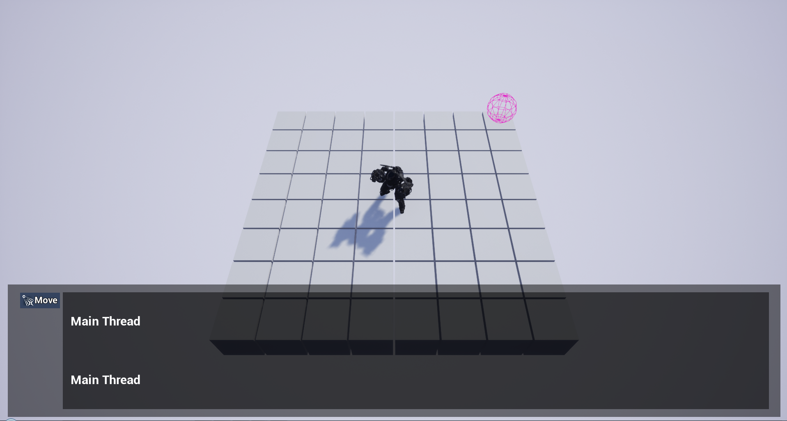
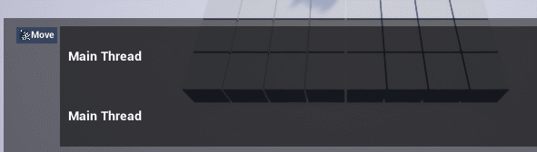

Learning new stuff is super cool!

## Project Setup

That's the beginning, the motivation is still overflowing. 

&nbsp;
&nbsp;

Because of my lack Unreal Engine 4 knowledge, I decided to try a lot of different stuff that will be required later.

## Experience

A lot of fail and refactoring, but that's how it works!

I defined some of my future base class including the "Function" class. It's part of the core gameplay so I've to focus on it right now.

     
    

        
         
        Some procedural level generation.
        That's a beginning! 
    

&nbsp;

     
    

        
         
        Setup a Main Character and it's Animation Blueprint (the Epic for the Paragon Assets)
    

&nbsp;

     
    

        
         
        First tries on the screen space UI and items drag n drop.
    

&nbsp;

     
    

        
         
        And some World Space UI! (and camera control!)
    

&nbsp;

I was looking for some cool binding features when I was working on the screen space UI but I didn't really found a good way to use it.

But with the World Space UI, I finally understood! So now it's time to re-re-refactor the main view to improve the core system!

Gambatteru!