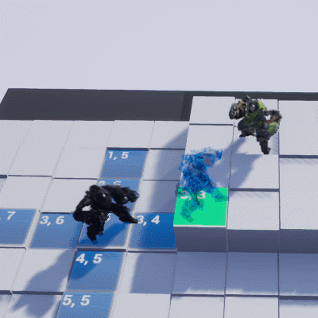
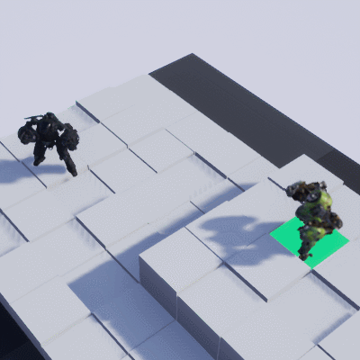

It's time to add new actions.

&nbsp;
&nbsp;

## Animation blueprint
This week I work on the animation system. But is too basic right now, I will build a better animation blueprint when the general game flow will be ok.
For the moment it's mostly montage and raw anim play.
&nbsp;
&nbsp;

### Jump & Shot

New learned stuff:

Timelines for the Jump action.
Easy particle for the ranged attack.

&nbsp;

     
    

        
         
        Jump
    

&nbsp;

     
    

        
         
        Ranged Attack
    

&nbsp;

See ya space marine.